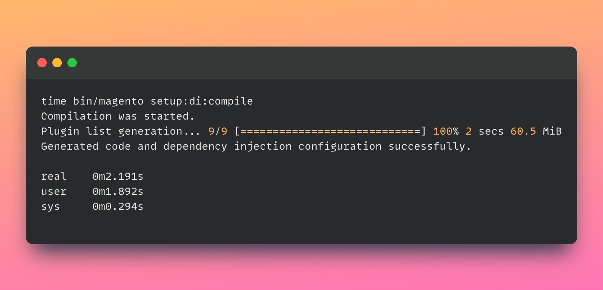

### PoC of extra light magento 2 base package with no modules

The idea started here: https://twitter.com/memegento/status/1599683267954765825

- just framework features like Dependency Injection, Declarative Schema, Modules etc.
- Compiles instantly
  
- Almost no dependencies in `./vendor`
```
magento
-- composer
-- composer-dependency-version-audit-plugin
-- framework
-- framework-amqp
-- framework-bulk
-- framework-message-queue
-- magento-composer-installer
-- magento2-base
-- zendframework1
```
- Installs like regular Magento 2 with no modules
  
- Has some basic DB tables
  

### Installation

```
bin/magento setup:install -v \
		--base-url="https://memegento.local" \
		--db-host="mariadb" \
		--db-name="base_di_test" \
		--db-user="root" \
		--db-password="root" \
		--admin-firstname="memegento" \
		--admin-lastname="memegento" \
		--admin-email="memegento@memegento.local" \
		--admin-user="memegento" \
		--admin-password="Qwerty23!" \
		--page-cache-id-prefix="meme_" \
		--cache-id-prefix="meme_" \
		--cleanup-database \
		--no-interaction
```

### Playground

Try to play with the file to see what's working
```
php pub/debug.php 
```

## Why o_O?
because why not

# What's next?

- Maybe someone will be inspired and will continue to work on this or similar project and can find this PoC usefull
- Maybe anybody would improve deps of core modules e.g. https://github.com/magento/magento2/pull/30886
- Maybe you want to optimize `setup:di:compile` or `setup:install` or `setup:upgrade` or other parts, and you do not need the whole codebase.
- Maybe someone likes Magento's DI, DB schema, Async operations, Modules etc. approach and can use this PoC repo to build their own light apps
- Maybe you want to rewrite Magento
- DWTFUW
